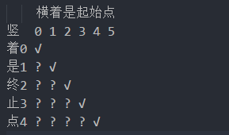

# Longest Palindromic Substring（5.最长回文子串）

## 题目描述
Given a string s, find the longest palindromic substring in s. You may assume that the maximum length of s is 1000.

### Example:
```
Input: "babad"

Output: "bab"

Note: "aba" is also a valid answer.
```

### Example:
```
Input: "cbbd"

Output: "bb"
```

## 思路分析
最长回文子串，第一反应就是使用动态规划，思想其实很简单，假如字符串str，回文字符串起止点是i，终止点是j(j >= i)：
- j = i: 是回文
- j - i <= 2: 如果str[i] == str[j]: 是回文
- j - i > 2: 在(i + 1, j - 1)是回文子串的前提下，如果str[i] == str[j]: 是回文

如下所示：


解题思想如上所示，提交之后也通过了，但是通过测试用例的时间只超过了15%。看了解题较快的代码，emmmm，竟然是蛮力，我觉得我可以好好考虑一下为什么。。。

## 代码
- 时间复杂度O(n²)
- 空间复杂度O(n²)

```
/**
 * @param {string} s
 * @return {string}
 */
var longestPalindrome = function(s) {
    let length = s.length;
    let is_palindrome = {};
    let max_len = 0;
    let result = "";
    let start = 0;
    
    for(let i = 0; i < length; i++) {
        is_palindrome[i] = {};
        for(let j = 0; j <= i; j++) {
            if( i - j <= 2) {
                is_palindrome[j][i] = s[i] === s[j];
            } else {
                is_palindrome[j][i] = is_palindrome[j+1][i-1] && s[i] === s[j];
            }
            
            if(is_palindrome[j][i] && i - j + 1 > max_len) {
                max_len = i - j + 1;
                start = j;
            }
        }
    }
    
    return s.substr(start, max_len);
};
```